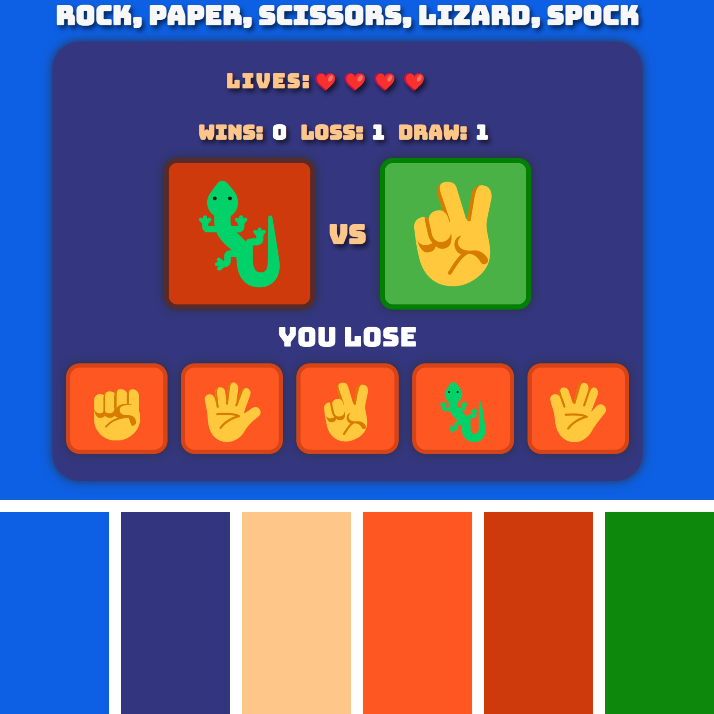
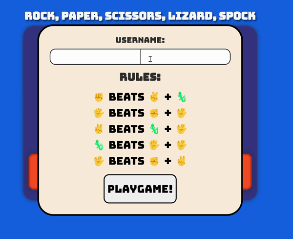
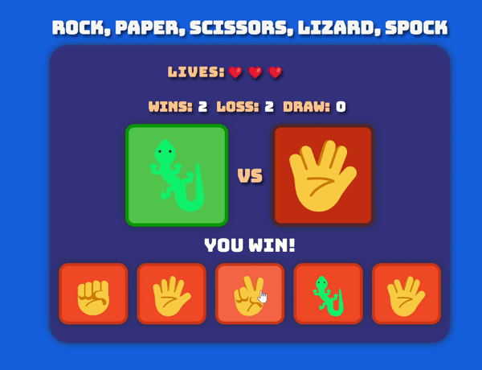

# Rock-Paper-Scissors-Lizard-Spock Game

[Click here](https://brandonn3lson.github.io/Rock-Paper-Scissors-Lizard-Spock/) to see deployed website!

## Table of Contents

- [About](#about)
- [Design](#design)
- [Features](#features)
- [Technologies Used](#technologies-used)
- [Frameworks and programs used](#Frameworks-and-programs-used)
- [Deployment](#deployment)
- [Testing and Validating](#testing-and-validating)
- [References](#references)

## About

- This is a web-based implementation of the popular game Rock-Paper-Scissors-Lizard-Spock. It extends the traditional Rock-Paper-Scissors game by adding two more choices, lizard and Spock, as inspired by the TV show "The Big Bang Theory".

- The Game is intended for users of all ages, weather it's to have a quick game to pass the time or compete with friends to see who gets the highest score.

## Design

- [Cooler](https://coolors.co/palettes/popular). The color pallet that was used was created using Cooler.

- **Emoji's**

  - used for images so design and layout may vary on different brands of mobile.

    - **Samsung**
      - [view here](assets/readme-images/samsung-emoji-design.jpg)
    - **Iphone**

      - [View here](assets/readme-images/iphone-emoji-design.jpg)

- **Balsamiq**
  - [Username input and rules design](assets/readme-images/balsamiq-username-and%20rules.png)
  - [Game layout for buttons and display](assets/readme-images/balsamic-game-layout.png)
  - [End Game Display](assets/readme-images/balsamiq-end-game-display.png)

## Features

- Players can input their username to start the game.

- Interactive buttons for the player to choose their move.
- Visual display of the player's choice and the opponent's choice.
- Lives counter to keep track of the player's remaining lives.
- Score tracking for wins, losses, and draws.
- Endgame display showing the final scores and allowing the player to play again.

## Technologies Used

- HTML
- CSS
- JavaScript

### Frameworks and programs used

- balsamic
- git (for version control)
- github (to save and store project)

## Deployment

Github Pages was used to deploy the live website. The instructions to achieve this are below:

1. Log in (or sign up) to Github.
2. Find the repository for this project, Rock-Paper-Scissors-Lizard-Spock.
3. Click on the Settings link.
4. Click on the Pages link on the left hand side.
5. In the Source section, choose main from the drop down select branch menu. Select Root from the drop down select folder menu.
6. Click Save. Your live Github Pages site is now deployed at the URL shown.

### Local Development

#### How to Fork

To fork the repository:

1. Log in (or sign up) to Github.
2. Go to the repository for this project, brandonn3lson/Rock-Paper-Scissors-Lizard-Spock.
3. Click the Fork button in the top right corner.

#### How to Clone

1. Find the repository for this project, Rock-Paper-Scissors-Lizard-Spock.

2. **Get the Clone URL** Click on the green "Code" button and copy the URL that appears.

3. Open Terminal or Command Prompt: Open the Terminal (Mac/Linux) or Command Prompt (Windows).

4. Navigate to the Directory: Use the cd command to go to the folder where you want to put the cloned repository.

5. Clone the Repository: Type git clone, paste the URL you copied, and press Enter.

6. Wait for it to Finish: It might take a moment. Once it's done, you'll see a message.

7. Done!: You now have a copy of the repository on your computer.

## Testing and Validating

For testing and and trouble shooting, i used the chrome dev tools while building the website to fix any issues while working through the project.

## Manaul testing

|    **Features**    |                                                    **Expected Outcome**                                                    |                      **Testing Performed**                       | **Pass/Fail** |
| :----------------: | :------------------------------------------------------------------------------------------------------------------------: | :--------------------------------------------------------------: | :-----------: |
|   Username Input   |                                               Saves username for end result                                                |                    Typed name into input box                     |     pass      |
|  Play Game Button  |                          Rules and Username section gets removed and allows you to play the game                           |                          Clicked button                          |     pass      |
|   "Rock" button    |                                            Display rock emoji un users display                                             |                          Clicked button                          |     pass      |
|   "Paper" button   |                                            Display paper emoji un users display                                            |                          Clicked button                          |     pass      |
| "Scissors" button  |                                          Display scissors emoji un users display                                           |                          Clicked button                          |     pass      |
|  "Lizard" button   |                                           Display Lizard emoji un users display                                            |                          Clicked button                          |     pass      |
|   "Spock" button   |                                            Display Spock emoji un users display                                            |                          Clicked button                          |     pass      |
|   Result Display   |                       when you win, lose or draw, it displays "You win", "You lose" or "It’s a Draw                        | played game multiple of times and watched for results to display |     pass      |
|    User Display    |                            Displays users choice, changes color depend if you win,lose or draw                             |                       Clicked all buttons                        |     pass      |
|  Opponent Display  |                    Displays Opponents randomly selected choice whenever user clicks any of the choices                     |                       Clicked all buttons                        |     pass      |
|   Lives Counter    | Whenever opponent wins, user loses a life, as soon as you have no lives left, game is reset and end result is made visible |               played game until I ran out of lives               |     pass      |
| end-result display |                when you lose, displays username and wins, losses and draws results and button to play again                |                         I lost the game                          |     pass      |
| Play again button  |                          when clicked it hides the end-result display to allow user to play again                          |                        Clicked the button                        |     pass      |

### Validators used

- W3C validator
- jigsaw css validator
- Jshint
- Waves

  ## W3C validator

  - [Index Page HTML](./assets/readme-images/index-page-w3c-validator.png)
  - [404 Error Page](./assets/readme-images/404-page-w3c-validator.png)

  ## jigsaw css validator

  - [css validator image](./assets/readme-images/css-validator.png)

  ## Lighthouse Analysis Report

  #### **Index page**

  - ##### Mobile

  

  - ##### Desktop

  

  #### **404 error page**

  - ##### Mobile

  

  - ##### Desktop

  

  ## jshint

  

  ## Wave Evaluation tool

  #### 404 page

  - [Wave Evaluation image](./assets/readme-images/wave-validator-404-page.png)

  #### Index page

  - [Wave Evaluation image](./assets/readme-images/wave-validator-index-page.png)

## References

- [Big Bang Theory](https://youtu.be/6s9k5rwBWB4?si=wPdgB2NyYvgMs2my)

- [ Stack Overflow "eventListener"](https://stackoverflow.com/questions/40956717/how-to-addeventlistener-to-multiple-elements-in-a-single-line): for the buttons i used this to give me an idea of how to add eventListeners to multiple elements.

## Credits

[Code Institute](https://codeinstitute.net/)
