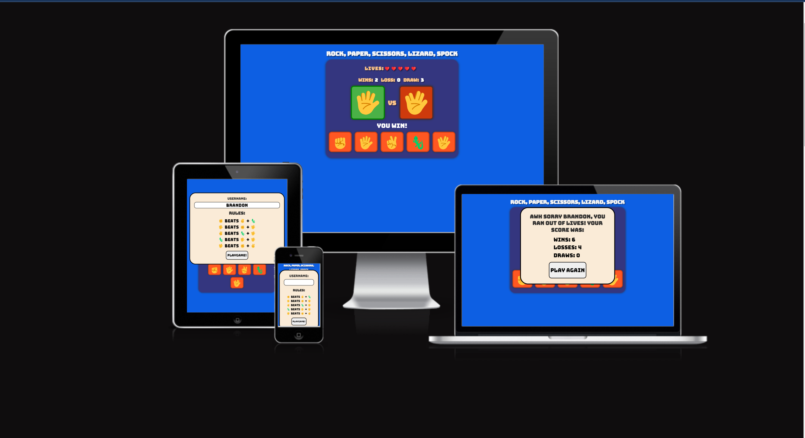
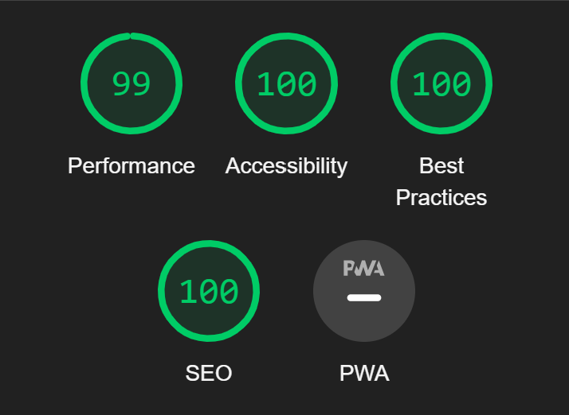
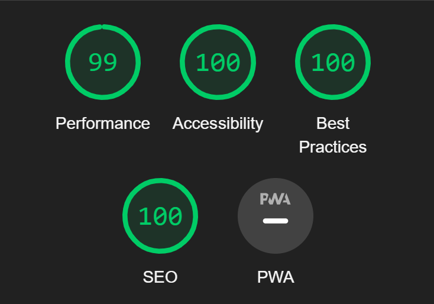
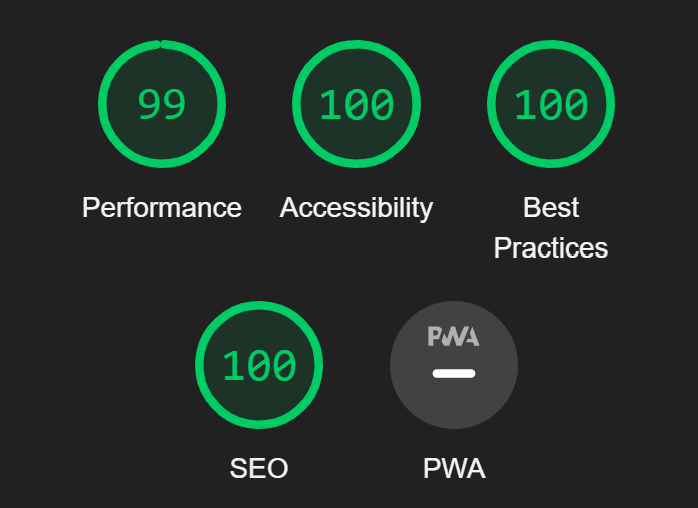
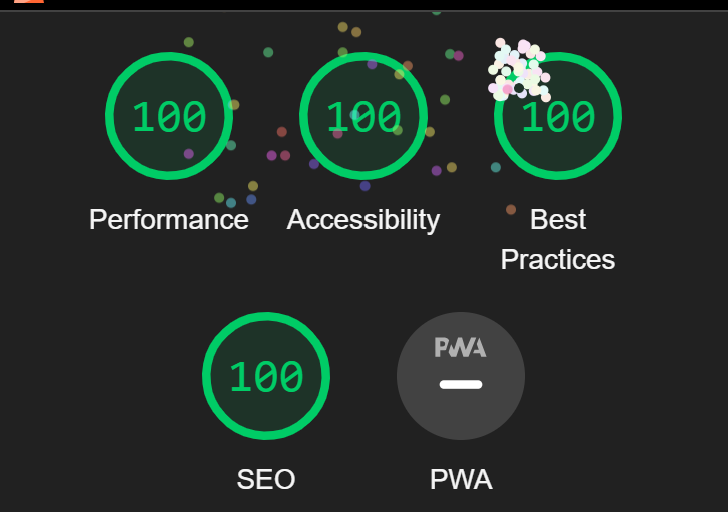
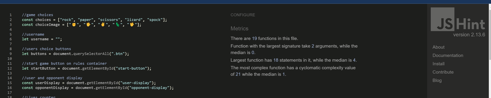

# Rock-Paper-Scissors-Lizard-Spock Game

[Click here](https://brandonn3lson.github.io/Rock-Paper-Scissors-Lizard-Spock/) to see deployed website!

## Table of Contents

- [About](#about)
- [Features](#features)
- [Technologies Used](#technologies-used)
- [Frameworks and programs used](#Frameworks-and-programs-used)
- [Deployment](#deployment)
- [References](#references)
- [Testing and Validating](#Testing-and-Validating)

## About

This is a web-based implementation of the popular game Rock-Paper-Scissors-Lizard-Spock. It extends the traditional Rock-Paper-Scissors game by adding two more choices, lizard and Spock, as inspired by the TV show "The Big Bang Theory".

## Features

- Players can input their username to start the game.

- Interactive buttons for the player to choose their move.
- Visual display of the player's choice and the opponent's choice.
- Lives counter to keep track of the player's remaining lives.
- Score tracking for wins, losses, and draws.
- Endgame display showing the final scores and allowing the player to play again.

## Technologies Used

- HTML
- CSS
- JavaScript

### Frameworks and programs used

- balsamic
- git (for version control)
- github (to save and store project)

### design

- [Cooler](https://coolors.co/palettes/popular). The color pallet that was used was created using Cooler
- Emoji's used for images so design and layout may vary on different brands of mobile.
  - **Samsung**
    - [view here](assets/readme-images/samsung-emoji-design.jpg)
  - **Iphone**
    - [View here](assets/readme-images/iphone-emoji-design.jpg)

## Deployment

Github Pages was used to deploy the live website. The instructions to achieve this are below:

1. Log in (or sign up) to Github.
2. Find the repository for this project, Rock-Paper-Scissors-Lizard-Spock.
3. Click on the Settings link.
4. Click on the Pages link on the left hand side.
5. In the Source section, choose main from the drop down select branch menu. Select Root from the drop down select folder menu.
6. Click Save. Your live Github Pages site is now deployed at the URL shown.

### Local Development

#### How to Fork

To fork the repository:

1. Log in (or sign up) to Github.
2. Go to the repository for this project, brandonn3lson/Rock-Paper-Scissors-Lizard-Spock.
3. Click the Fork button in the top right corner.

## Testing and Validating

For testing and and trouble shooting, i used the chrome dev tools while building the website to fix any issues while working through the project.

### Validators used

- w3c validator
- jigsaw css validator
- Jshint
- Waves

### W3C validator

- [Index Page HTML](./assets/readme-images/index-page-w3c-validator.png)
- [404 Error Page](./assets/readme-images/404-page-w3c-validator.png)

### jigsaw css validator

- [css validator image](./assets/readme-images/css-validator.png)

### Lighthouse Analysis Report

#### **Index page**

##### Mobile

##### Desktop

#### **404 error page**

##### Mobile

##### Desktop

### jshint

### Wave Evauluation tool

#### 404 page

- [Wave Evaluation image](./assets/readme-images/wave-validator-404-page.png)

#### 404 page

- [Wave Evaluation image](./assets/readme-images/wave-validator-index-page.png)
